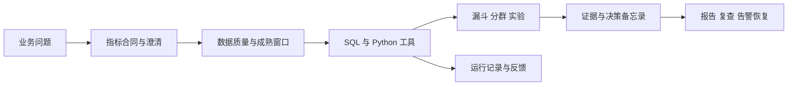

# 刘希 · AI 数据分析

**从增长问题，到有证据的业务决定。**

围绕新用户承接、留存变化、实验评审和复购运营，将业务口径、事件数据、SQL/Python 分析与受控 AI 工具调用连接成可复现的工作流。项目覆盖指标设计、数据建模、诊断、统计、API、报告与产品界面。

- [在线作品集](https://liu-xi71.github.io/liu-xi-ai-analyst/)
- [源码](https://github.com/liu-XI71/liu-xi-ai-analyst)
- [原有业务案例](https://liu-xi71.github.io/)

## 核心业务案例

| 业务问题 | 分析与交付 | 验证方式 |
|---|---|---|
| 新用户留存下降，优先处理什么？ | 精确 D7、24h 有序漏斗、渠道×端分解、版本关联、验证事项、实验建议 | 原始事件复算、口径与 SQL、分解闭合 |
| 指标下降是否由数据延迟造成？ | 批次清单、连续水位、成熟条件、受影响指标阻断、回填重算 | 同一原始事件的不同到达快照；恢复不等于业务好转 |
| 实验正向，是否具备灰度条件？ | 预注册窗口、ITT、SRM、功效规划、效应区间、负反馈非劣围栏 | 8 类实验场景、原始分配/结果日志、质量检查 |
| 复购预算应该如何安排？ | 截止日前 RFM、成熟复购、预算候选、随机留出计划 | 时点一致性、成本上限、去重与留出复算 |

公开数据为固定种子生成的匿名合成数据，用于验证分析方法和软件行为。案例中的比例、实验差异与预算均可计算，不代表任何企业实际经营成绩。原有业务经历与此项目分开展示。

## 产品工作流



- **指标语义**：精确 D1、精确 D7、次1—7日回访、24h激活各自定义；版本化字典是单一来源。
- **数据基础**：110 日注册范围、匿名用户、事件时间与到达时间、端/版本、源端批次清单、发布记录。
- **分析方法**：有序漏斗、联合分层的对称变化分解、版本关联与验证事项；描述性贡献不冒充因果。
- **实验决策**：从预注册参数计算样本量，检查 SRM、分配/采集/配置/成熟；以区间、业务门槛和非劣围栏共同评审。
- **AI 工作流**：模型处理问题与工具参数，确定性函数计算业务数字；结构化计划、证据引用、拒绝与澄清均留有记录。
- **运营闭环**：幂等批次、数据告警与业务告警分别管理、回填与恢复；真实请求技术遥测与自愿反馈单独统计。

## 三种运行方式

| 方式 | 能力 | 标识 |
|---|---|---|
| 静态案例回放 | 13 个实际计算场景、完整图表/SQL/报告，可直接放到 GitHub Pages | 不执行自由输入，不调用模型 |
| Python 动态分析 | 修改日期、渠道、端、指标后实际取数并生成新运行记录 | 有限语义规则与确定性工具，不计为 LLM 测试 |
| OpenAI 模型分析 | Responses 工具调用：上下文、指标、计划、质量、查询、分析和报告 | 需要安全配置模型凭据；无凭据明确失败，不替代为回放 |

当前公开站点为静态案例，未连接云端 Python 服务，真实模型实测状态为 `not_run`。本地服务默认执行 Python 规则分析；选择模型模式后才向 OpenAI 发起请求。成功调用、答案核验和用户研究分别记录。规则模式检查已识别的文字日期、设备、渠道、版本、地区和预算是否与表单一致；条件缺失或冲突时先澄清。未实现通用自然语言解析，复杂问题需使用经过验收的模型模式。

模型读取业务合同、登记分析计划、调用只读查询及业务工具，再选择已核验事实生成报告。任务、日期和筛选条件锁定；模型更改显式条件将被拒绝。只有 `mode=live`、`provider=OpenAI`、`live_verified=true` 同时成立，结果才标记为已核验模型调用。

## 本地运行

Python 3.11+，推荐 3.12。

```bash
git clone https://github.com/liu-XI71/liu-xi-ai-analyst.git
cd liu-xi-ai-analyst
python -m venv .venv
source .venv/bin/activate
python -m pip install -r requirements-dev.txt -c constraints-tested.txt
python -m pytest -q
python scripts/export_demo.py
sh scripts/start.sh
```

访问 `http://127.0.0.1:8765`；接口说明位于 `/docs`。Windows 激活 `.venv\Scripts\Activate.ps1` 后执行 `python -m uvicorn app.main:app --host 127.0.0.1 --port 8765`。

仅发布静态作品集时，上传 `web/` 的全部内容即可。路径相对化，支持 GitHub Pages 项目子目录；JSON 案例和 HTML/Markdown 报告包含在目录内。[部署说明](docs/deployment.md)

## 复现与验证

```bash
python -m pytest -q
python scripts/evaluate.py
python scripts/evaluate.py --suite audit
python scripts/evaluate_v2.py
python scripts/export_demo.py
python scripts/run_monitor.py --scenario late_data
python scripts/run_monitor.py --scenario recovered
```

已暴露的评测题属于公开回归，不称为盲测。指标基准独立从用户、活动、订单或事件聚合；SQL 证据可以重放。模型测试替身仅验证协议，结果明确标为未进行真实调用。[评测说明](docs/evaluation.md)

## API 与数据合同

| 路径 | 用途 |
|---|---|
| `GET /api/health` | 服务状态与模型配置状态 |
| `GET /api/v1/catalog` | 业务域、数据范围、指标、场景与默认请求 |
| `GET /api/v1/metrics/{domain}` | 已注册指标合同 |
| `POST /api/v1/analyze` | 新用户、实验、复购、历史增长域分析 |
| `POST /api/v1/sql/preview` | 受控只读 SQL 核验 |
| `GET /api/v1/runs/{id}` | 已保存分析结果 |
| `GET /api/v1/runs/{id}/report?format=html` | 独立 HTML / Markdown 报告 |
| `GET /api/v1/monitoring` | 批次、告警与状态迁移 |
| `POST /api/v1/monitoring/run` | 管理员触发幂等批次 |
| `GET /api/v1/usage` | 实际技术运行与自愿反馈汇总 |
| `POST /api/v1/feedback` | 持运行反馈凭证提交或更新评价 |
| `GET /api/v1/evaluations` | 各套评测结果及其验证边界 |

```json
{
  "domain": "onboarding",
  "question": "比较两个成熟注册周的精确D7，并检查用户路径",
  "task": "diagnose",
  "mode": "demo",
  "start": "2026-08-24",
  "end": "2026-08-30",
  "compare_start": "2026-08-17",
  "compare_end": "2026-08-23",
  "filters": {"metric": "new_user_retention_d7", "scenario": "business_drop"}
}
```

响应包含指标合同、质量检查、KPI、结果表、图表、验证事项、决策、SQL 证据、运行记录和来源版本。事件明细不含真实个人身份。

## 实现与设计资料

- [四个完整业务案例](docs/business-cases.md) · [独立阅读与打印版](https://liu-xi71.github.io/liu-xi-ai-analyst/resources/business-cases.html)
- [运行链路验收与当前状态](docs/runtime-verification.md)
- [架构与执行边界](docs/architecture.md)
- [新用户事件、指标与成熟规则](docs/onboarding-data.md)
- [实验设计、统计与决策规则](docs/experiment-methods.md)
- [复购数据与时点分群](docs/repurchase-data.md)
- [运行监控与产品反馈](docs/operations.md)
- [真实试用研究协议与记录模板](docs/user-study-protocol.md)
- [评测方法](docs/evaluation.md)
- [部署与复现](docs/deployment.md)
- [业务讲解与复现路线](docs/interview-guide.md)

业务 Skill 与实际计算共用合同，包含输入、前置条件、步骤、停止条件和输出格式。通用框架提供基础能力，业务定义和分析规则在本仓库中实现。[第三方来源](THIRD_PARTY_NOTICES.md) · [MIT 许可](LICENSE)
