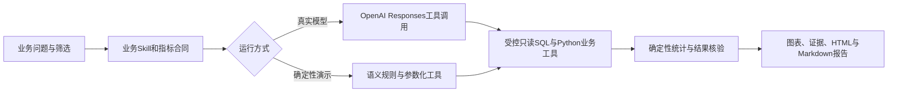

# 刘希｜AI 数据分析作品集

**把业务问题转成可核验的数据结论，把重复分析做成可复用的AI工作流。**

这是面向业务型AI数据分析师求职的独立新项目：以增长诊断与自动报告为主场景，用Python工具完成取数、统计、图表与证据组织，再把相同方法应用于复购运营。原个人主页与已有项目链接保留。

- 新源码仓库：[liu-XI71/liu-xi-ai-analyst](https://github.com/liu-XI71/liu-xi-ai-analyst)
- 新作品集（GitHub Pages）：[独立项目页](https://liu-xi71.github.io/liu-xi-ai-analyst/)
- 原作品集：[liu-xi71.github.io](https://liu-xi71.github.io/)

GitHub Pages 发布状态见 Actions。Python 动态服务已在本地验收；Render 云部署与真实模型验证仍需完成账户安全配置。本仓库中的 Docker 与 Render 文件是部署配置，不等于云服务已经上线。

## 作品展示顺序

1. **增长诊断与自动报告Agent**：从业务问题、指标口径、SQL证据到图表、事实与行动建议。
2. **增长与实验业务案例**：展示原有分析方法、业务判断与证据，个人经历和模拟Agent运行分别说明。
3. **可复用分析工具**：原CSV分析工作台，以及本项目新增的复购分群、成熟队列复购与预算留出计划。

## 已实现的工程链路



| 能力 | 当前实现 |
|---|---|
| 企业业务知识 | 应用实际加载`skills/growth-diagnosis`与`skills/repurchase-operations`；包含指标口径、时间边界、分析分支与输出约束 |
| Python工具接口 | FastAPI目录、业务分析、SQL核验、运行记录、报告和评测接口 |
| 增长分析 | 合成用户与事件明细上的成熟次7日留存、渠道/设备拆分、变化分解、实验复盘和报告 |
| 复购分析 | 合成订单上的成熟7/30日复购、历史时点分群、匿名候选、预算上限与固定seed随机留出建议 |
| SQL与证据 | 参数化业务SQL及受控只读SQL执行；返回实际SQL、参数、行、来源和指标版本 |
| 真实模型适配 | OpenAI Responses调用上下文、分析和查询工具；报告选择已有事实，不让模型随意编造指标 |
| 展示与复现 | 独立静态作品页、动态Python工作台、Docker/Compose、GitHub Actions与Render Blueprint |

所有演示数据均为固定种子合成数据。这里的留存、实验差异、正向交易额或预算计划不属于任何企业实际经营成果。复购随机留出是计划，尚未执行营销触达。

## 三种模式与验证边界

- **静态回放**：GitHub Pages读取预计算JSON，便于招聘方直接查看完整证据；不能任意取数，也没有模型调用。
- **后端demo**：无需Key，有限语义规则与参数化Python工具真实执行SQL、计算与报告。它用于展示可复现链路，不宣称是LLM。
- **live**：配置OpenAI Key后，由真实模型通过受控工具进行任务执行。默认模型`gpt-5-mini`，可通过`OPENAI_MODEL`修改；缺Key、权限或额度时明确返回失败，不回退伪装live。

业务单元测试与mock模型测试仅验证代码行为。真实模型的结果正确率、稳定性、时延、token与人工节省时间，须由实际运行记录另行证明；未验证项不写成既得成果。当前评测页与`evals/`是可查阅证据，不能把确定性测试通过率当成大模型问数准确率。

## 快速开始

需要Python 3.11及以上，推荐3.12。

```bash
git clone https://github.com/liu-XI71/liu-xi-ai-analyst.git
cd liu-xi-ai-analyst
python -m venv .venv
source .venv/bin/activate
python -m pip install -r requirements-dev.txt
python -m pytest -q
python scripts/export_demo.py
sh scripts/start.sh
```

打开`http://127.0.0.1:8765`查看工作台，打开`http://127.0.0.1:8765/docs`查看API。首次启动会生成合成数据库。Windows用户可激活`.venv\Scripts\Activate.ps1`后运行`python -m uvicorn app.main:app --host 127.0.0.1 --port 8765 --workers 1`。

需要真实模型时，在本机将`.env.example`复制为`.env.local`，用编辑器配置Key和模型；Key不提交到GitHub，不放入前端。远程live服务使用独立的`LIVE_ACCESS_TOKEN`。完整步骤见[部署与复现说明](docs/deployment.md)。

## 演示路径

先运行增长默认问题，检查留存口径、成熟分母、渠道/设备结果和SQL。随后改变筛选重新计算，再试一个精确D7问题，观察系统对口径歧义的澄清。最后下载报告，核对图表数字与证据。

复购场景可尝试：

> 截至5月31日，按历史购买分群，在200元预算内制定召回候选与随机留出方案。

系统输出截止日前RFM、匿名候选、计划处理/留出分组及预算核算。改变seed会改变分配，截止日后的订单不能改变原时点候选。次7/30日复购采用完整观察队列，正向交易额明确不等于净LTV。[复购数据与口径说明](docs/repurchase-data.md)

## API

| 方法与路径 | 用途 |
|---|---|
| `GET /api/health` | 健康检查与模型是否配置 |
| `GET /api/v1/catalog` | 业务域、指标、表、日期范围、默认请求与示例 |
| `POST /api/v1/analyze` | `demo`/`live`业务分析 |
| `POST /api/v1/sql/preview` | 受控只读SQL辅助核验 |
| `GET /api/v1/runs/{id}` | 读取已保存运行 |
| `GET /api/v1/runs/{id}/report?format=html` | 下载HTML报告；也支持`md` |
| `GET /api/v1/evaluations` | 读取已生成评测结果 |
| `GET /api/v1/skills/{domain}` | 查看应用实际加载的业务上下文 |

```bash
curl -X POST http://127.0.0.1:8765/api/v1/analyze \
  -H 'Content-Type: application/json' \
  -d '{"question":"生成复购运营报告","domain":"repurchase","task":"report","mode":"demo","start":"2026-03-01","end":"2026-05-31","filters":{"budget":200,"contact_cost":2,"holdout_ratio":0.2}}'
```

响应包含`run_id`、口径合同、KPI、表、图表、事实/假设/建议、SQL证据和工具轨迹。数值由确定性代码计算；运行轨迹是可审计工具记录，不是隐藏思考过程。

## 项目结构

```text
app/
  domains/          增长与复购确定性业务域
  live_agent.py     真实模型的有界工具循环
  sql_tools.py      只读查询边界
  reports.py        HTML / Markdown报告
  main.py           FastAPI与运行记录
skills/             实际加载的业务规则
web/                独立首页、工作台与静态回放
evals/              问题集及评测证据
tests/              业务、API和工具边界测试
scripts/            启动、评测与离线导出
docs/               数据口径与部署说明
```

普通CI不使用OpenAI Key，执行`pytest`和静态导出。Pages工作流只发布新仓库`web/`。Docker与Render配置支持独立托管Python服务；Render免费实例存在冷启动与临时存储边界，详见部署说明。

## 个人实现与参考

这个项目把已有的增长与复购分析方法封装为可执行业务合同、Python工具和可核验运行结果。公开框架用于基础设施，业务指标、分群规则、确定性计算、失败分支与证据说明可直接从代码核查。[来源和第三方说明](THIRD_PARTY_NOTICES.md)列出旧作品归属、依赖与设计参考。

本仓库新增代码采用[MIT许可证](LICENSE)。实际业务接入需要另行获得数据权限，并根据真实业务重新校验口径、实验设计与访问控制。
