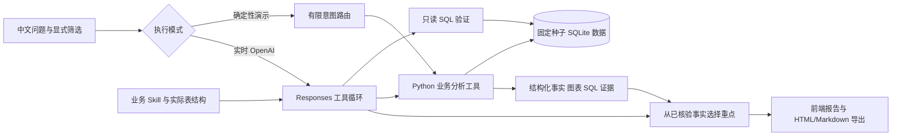

# 架构与执行边界

项目将业务口径放进可版本化 Skill，把数值计算交给可测试 Python 函数，把模型限定在理解问题、选择参数、调用工具和挑选已核验结论的范围内。这样可以展示 AI 如何进入业务分析流程，并保留逐项复算的能力。

## 三种实际运行状态

| 状态 | 问题输入 | 数据计算 | 模型调用 | 界面标识 |
|---|---|---|---|---|
| GitHub Pages 静态回放 | 查看固定案例 | 构建时执行 Python | 无 | 静态演示回放 |
| Python API 确定性演示 | 有限已定义任务与明确筛选 | 每次读取 SQLite、重新计算 | 无 | 确定性演示 |
| Python API 实时模式 | 自然语言理解与工具选择 | Python 计算，允许模型额外生成只读 SQL | 真实 OpenAI Responses | 真实模型与工具记录 |

实时模式需要服务端 `OPENAI_API_KEY`；没有密钥或提供商请求失败会返回错误，不会改用演示结果宣称模型成功。`tests/test_api.py` 中的假客户端只检验工具协议，不属于真实模型评测。

## 业务方法

增长主场景采用成熟队列的次 7 日内留存，以渠道 × 设备联合分层做对称变化分解；结构贡献与组内表现贡献之和等于整体差值。它说明变化的算术来源，不证明因果。实验场景独立计算随机分组效果、区间与护栏。

复购场景排除观察窗口不完整的首次购买客户，以分析时点计算 RFM，限制候选触达成本并设置随机留出组。建议名单是合成客户，不包含真实个人信息；系统不自动发送营销消息，也不声称已经提高复购。

## API 与数据约束

FastAPI 提供 `/api/v1/catalog`、`/api/v1/analyze`、`/api/v1/sql/preview`、运行记录、报告和评测接口。SQL 同时通过 AST 校验、开放表限制、SQLite 只读连接与 authorizer；查询有时间、行数、表达式复杂度和结果长度限制。每次分析保留实际参数和 SQL 证据。

公开部署默认关闭无令牌实时调用。`LIVE_ACCESS_TOKEN` 保护模型入口，`OPENAI_API_KEY` 仅留在后端。服务采用单 worker，内存限流与并发限制只是作品集部署的基本保护；若用于真实企业系统，应扩展为身份认证、租户隔离、权限化指标层、集中限流与审计存储。

免费云实例可能休眠、重启并清除临时 SQLite 运行历史。固定种子业务数据可重建。正式业务部署应使用持久化数据库，并制定数据保留和备份策略。
