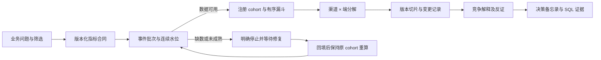

# 新用户增长诊断：事件模型、口径与可复算证据

新用户增长诊断从注册后的产品路径出发，回答三个问题：指标变化是否可信，变化集中在哪些用户和步骤，以及下一步应验证什么。核心结果是精确 D7 留存，24 小时有序激活是早期观察指标；输出是带 SQL 证据的决策备忘录。

## 数据与范围

- 数据源：固定随机种子 `710919` 生成的匿名合成产品事件。覆盖 **2026-06-01 至 2026-09-18，共 110 个自然日**。
- 当前生成器版本提供 **13,698 个注册用户、117,133 条事件、330 个日 × 设备源端批次**。事件量由生成器与随机种子决定，不作为真实经营规模。
- 匿名 `user_id` 稳定且唯一；不包含姓名、电话、账户 ID 或真实企业数据，不进行跨设备身份合并。
- 产品模型是注册后必须经过引导再进入首屏的内容消费场景。跳过引导的其他产品路径需要新合同，不能直接沿用这里的漏斗。
- 所有时间字符串是 `Asia/Shanghai` 本地时间，格式为 `YYYY-MM-DD HH:MM:SS`。服务接入其他时区时，必须在写入层转换并保留原始来源时区。
- 基准演示当前 cohort 为 **2026-08-24—08-30**，对比 cohort 为 **2026-08-17—08-23**。

合成事件证明计算、判断边界和工程闭环，不代表真实经营增量、真实用户满意度或在线模型准确率。

## 业务流程



## 单一指标合同

正式口径保存在 [`app/data/onboarding_metrics.json`](../app/data/onboarding_metrics.json)。版本 `onboarding.v2.0.0` 驱动指标名称、输出单位、主指标选择、成熟条件、事件阈值、允许维度和页面说明。SQL 计算引用合同中的固定计算列，用户输入不能成为 SQL 表名或表达式。

合同包含十项指标：新注册用户、24h 引导完成、24h 有序首屏成功、24h 有序激活、精确 D1、精确 D7、次 1—7 日回访、DAU、首次 Feed 请求失败、24h 负反馈。

| 口径 | 计算约束 | 常见错误的处理 |
|---|---|---|
| 精确 D1 | cohort 用户在注册后第 1 个自然日发生 `app_active` | 不当作注册后 24 小时回访；23:59 注册的用户在次日 00:00 活动可计入 D1 |
| 精确 D7 | cohort 用户在注册后第 7 个自然日发生 `app_active` | 不混同一周内任意回访 |
| 次 1—7 日回访 | 第 1 至第 7 个自然日内有至少一次 `app_active` | 同一用户多次回访只计一次；注册当天不计入 |
| 24h 有序漏斗 | 注册→引导完成→首屏成功→单次有效消费 ≥60秒；严格有序，全部在 `[signup_at, signup_at+24h)` 内 | 首屏早于引导不计路径转化；恰好发生在 24h 端点的事件不计入；D1/D7不属于漏斗步骤 |
| 首次 Feed 失败 | 先按 `(event_time, event_id)` 选择 24h 内第一条请求，再以同一用户及 `request_id` 关联请求后的结果；首次明确失败人数 / 有首次请求人数 | 后续另一请求失败不能改写首次成功；结果缺失、成功/失败冲突、request_id 缺失或不能唯一关联时，该切片失败率为 `NULL` |
| DAU | 全注册样本中当天 `app_active` 或 `content_consumed` 去重用户 | 注册本身不算活跃；跨日求和是用户日，不是期间去重用户 |

“未成熟”“尚未到达”“没有注册用户”和真实的零成功人数分别处理。系统不会把前面三类自动写成 0%。D1 可用但 D7 不可用时，D1 可继续分析，D7 在表格及 SQL 证据结果中保留 `NULL`。成熟、水位、schema 和事件关系均按各指标的完整观察窗口分别校验；不能使用 D1 窗口的通过状态授权 D7。例如未知 schema 仅发生在 D7 的后续事件日时，D1 仍可用，D7 与次 1—7 日回访单独被阻断。

## 事件与表模型

| 表 | 粒度 | 用途 |
|---|---|---|
| `onboarding_users` | 一个匿名注册用户 | 注册时间、注册日、获客渠道、端、注册版本 |
| `onboarding_events` | 一个去重事件 ID | 事件时间、到达时间、事件日、匿名用户、端/渠道/版本、批次、schema、请求 ID、有效消费秒数 |
| `onboarding_ingest_batches` | 事件自然日 × 设备 | 源端应到计数、清单可获得时间，供批次完整性核对 |
| `onboarding_changes` | 一次变更 | 发布、获客配置及数据管道维护记录 |
| `onboarding_snapshots` | 一个可查询快照 | 统一的 `as_of` 读取截止 |
| `onboarding_metadata` | 一个技术版本项 | 生成版本、口径签名、种子、时区 |

`event_id` 为主键，索引支持用户 × 事件名 × 时间、批次 × 到达时间、事件日 × 设备查询。数据初始化幂等，不修改其他业务域的表。

数据库业务表不提供 `root_cause`、`expected_answer` 或异常答案标签。归因依据来自查询结果和变更记录；变更日志只说明发生过什么，不声明它导致了指标变化。

## 三种快照真正查询了什么

三个场景查询同一份事件，区别由 `ingested_at <= as_of` 决定，不在结果层改写数字或仅切换文案。

| 场景 | 可见时间 `as_of` | 连续水位 | 默认 D7 状态 |
|---|---|---|---|
| `business_drop` | 2026-09-19 08:00 | 2026-09-19 00:00 | 完整，可分析 |
| `late_data` | 2026-09-07 08:00 | 涉及 Android 时为 2026-09-04 00:00 | Android 的 9 月 4—6 日三个批次未到达，停止受影响结论 |
| `recovered` | 2026-09-08 12:00 | 2026-09-08 00:00 | 三个批次已经回填，原 cohort 重算恢复 |

水位表示此前事件时间已连续完整到达的**排他上界**。例如水位 `2026-09-07 00:00` 说明 9 月 6 日已完整，不能代表 9 月 7 日的事件也已完整。精确 D7 的注册日为 8 月 30 日时，水位至少需要覆盖 9 月 7 日零点。

质量门禁会检查：

1. 观察窗口确实结束：自然日指标按完整日；24h 指标按本次 cohort 最晚注册时间加 24h。
2. 相关设备分区的连续水位覆盖所需窗口，不能跨过缺失日。
3. 已知源端清单计数与当前可见事件计数一致；缺清单无法通过水位。
4. 事件版本受合同支持。
5. 用户引用、事件时间与到达时间关系合法，事件 ID 唯一。`event_time` 是事件发生时间（即 occurred_at）；`event_date` 必须等于该时间在 Asia/Shanghai 的自然日。留存计算由事件时间派生日期，冗余日期不一致时同时阻断质量。
6. 本演示域的渠道、设备和版本属于固定注册上下文，事件字段必须与用户注册记录一致；`batch_id`、批次自然日与设备必须相符。验证范围同时检查用户归属设备、事件设备与批次设备，不能通过修改事件设备把异常移出目标人群的检查。
7. 每个旁路指标独立执行自身窗口内的 schema 与事件关系检查，输出对应证据 ID 和可用性；主指标通过不等于所有旁路指标通过。

分区质量按设备保守检查。Android 分区不完整不会阻止一个纯 iOS cohort 的分析；一个特定版本的分析仍会继承它所在设备分区的可用性约束。源端清单检查不证明所有未知源端漏报都能被发现。

## 实际可复算的基准结果

以下为当前生成器和合同上的实际执行结果，非模型估计。

| 指标 | 对比期：856 人 | 本期：898 人 | 变化 |
|---|---:|---:|---:|
| 精确 D1 | 333 / 856 = 38.902% | 265 / 898 = 29.510% | -9.392 pp |
| 精确 D7 | 233 / 856 = 27.220% | 191 / 898 = 21.269% | -5.950 pp |
| 次 1—7 日回访 | 513 / 856 = 59.930% | 423 / 898 = 47.105% | -12.825 pp |
| 24h 有序激活 | 535 / 856 = 62.500% | 391 / 898 = 43.541% | -18.959 pp |

D7 变化的渠道 × 端对称分解为：结构项 **-0.916 pp**，组内表现项 **-5.034 pp**。二者与总体变化闭合，不能分别按渠道、按端拆解后再次相加。

同一 cohort 的有序漏斗：

| 步骤 | 对比期人数 | 本期人数 | 本期环节转化 |
|---|---:|---:|---:|
| 注册成功 | 856 | 898 | 100% |
| 引导完成 | 744 | 725 | 80.735% |
| 首屏成功 | 693 | 544 | 75.034% |
| 有效消费 ≥60秒 | 535 | 391 | 71.875% |

首屏环节转化从 **93.145% 降至 75.034%**，变化 **-18.111 pp**。本期 Android 1.9.0 切片有 467 人，其首次 Feed 请求失败率为 **160 / 367 = 43.597%**；这构成优先核查路径和版本日志的线索，不是随机实验因果结论。

系统会同时保留获客结构、路径体验、数据延迟三类竞争解释。每个解释包含支持证据、反证或尚未排除的混杂，以及下一项能区分解释的验证。建议进入修复实验前冻结主要指标、样本条件与围栏；此模块不假称已执行实验或产生真实收益。

## 输出协议

保留通用分析字段：`status`、`title`、`summary`、`metric_contract`、`kpis`、`tables`、`charts`、`findings`、`evidence`、`trace`、`limitations`、`suggestions`。

额外字段：

- `plan`：固定分析阶段、工具用途及执行状态。
- `data_quality`：可见时间、水位、检查结果、受影响批次、每项指标的成熟/可用状态。
- `funnel`：窗口、顺序、人数、cohort 转化、环节转化、人数损失、最大变化。
- `hypotheses`：支持、反证、下一项验证。
- `decision`：建议状态、行动、复查触发条件；负责人未提供时显示“待分配”。

输入边界：默认比较期若跨越可表示的最早日期，返回结构化 `needs_clarification`；超出样本日期范围返回 `insufficient_data`，不抛出日期减法溢出或静默截断。

主要状态：

| 状态 | 含义 | 业务数值 |
|---|---|---|
| `completed` | 请求范围通过校验并完成指定任务 | 显示已验证成熟的数值 |
| `needs_clarification` | 日期、筛选或文字指标冲突 | 不显示业务 KPI |
| `insufficient_data` | 无 cohort、请求超出范围、观察未成熟 | 不把缺数或未成熟当作 0 |
| `data_quality_blocked` | 水位、批次或事件合同失败 | 停止受影响的经营判断 |

每条事实引用可执行 SQL 证据。证据含参数、结果行、快照、指标版本和数据来源，可直接重放；描述性贡献在代码中从查询结果计算并校验闭合误差。

## 本地复现

```python
from pathlib import Path
from app.domains import onboarding

path = Path("var/analytics.sqlite")
onboarding.build_database(path)
result = onboarding.analyze({
    "question": "最近两个成熟注册周的精确 D7 为什么变化？",
    "task": "diagnose",
    "start": "2026-08-24", "end": "2026-08-30",
    "compare_start": "2026-08-17", "compare_end": "2026-08-23",
    "filters": {"metric": "new_user_retention_d7", "scenario": "business_drop"}
}, path)
print(result["summary"])
```

使用 `late_data` 和 `recovered` 重复请求，其他参数不变，即可验证停止和恢复行为。支持的维度为 `channel`、`device`、`app_version`；枚举由 `metadata()` 返回。明确提及 D1、D7、次 1—7 日回访或 24h 激活时可识别对应口径，显式指标与问题冲突时请求澄清。复杂任意自然语言解析交由独立模型编排层，该函数不声称无限制理解任意问题。

运行验证：

```bash
.venv/bin/python -m unittest tests.test_onboarding -v
```

测试覆盖事件级独立复算、跨自然日边界、严格顺序、24h 排他端点、真实到达延迟、回填相等性、分区隔离、未知事件版本、缺清单、SQL 证据重放、参数化筛选及分解闭合。通过这些测试证明确定性分析合同；不能用它代替真实模型评测或真实用户试用。


## 事件边界回归验证

`tests/test_onboarding_boundaries.py` 使用独立构造/变异事件核对：D1 主请求下 D7 单独存在未知 schema 或设备不一致、冗余日期被改写、设备标签越出筛选、源端计数一致但批次归属错误、无效时间戳、首次成功后另一次失败、首次失败后重试成功、缺失或冲突的请求关联，以及最早/最晚可表示日期。

默认合成样本没有修改种子、事件或成熟口径。D1、D7、窗口回访、激活、分解、漏斗及版本切片的原有数值与冻结快照保持一致；新增内容为每指标质量证据和首次请求未解析计数，不将这些回归通过当作真实模型准确率。
